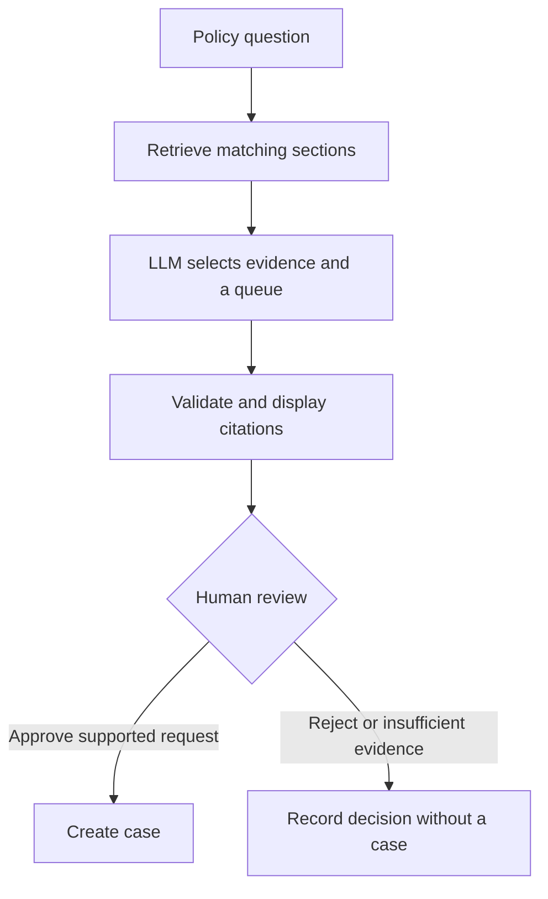

# Cedarbridge Bank Policy Review Agent

A policy review workflow built with n8n and Python. It helps operations staff find the relevant policy, identify the right review team, and create a case after a human checks the evidence.

Cedarbridge Bank is a fictional financial-services customer. The three policy documents in this repository are synthetic.

## The problem

Questions about AI tools and vendor onboarding often require someone to search several policies and work out which team owns the decision. This project brings those steps into one review flow. The model recommends a route, and a reviewer decides whether to create the case.

For example, a request to upload customer statements to a public AI chatbot retrieves policy AI-01, which prohibits that use and routes the request to SecurityReview. Approving the review creates a case for that team; it does not authorize the upload.

## How it works



Retrieval uses BM25 over eight sections from three Markdown documents. The model selects evidence IDs and a queue, or returns `insufficient`. The review page displays the exact selected excerpts with their source title, section and version.

The API stores retrievals, proposals, decisions and cases in SQLite. Before creating a case, it checks the proposal age, source-file hashes and whether the decision has already been processed.

See [Architecture](docs/ARCHITECTURE.md) for the API contracts and design decisions, or download the [five-slide overview](presentation/Jeen-Policy-Agent.pptx).

## Run locally

Requirements: Docker Desktop with Linux containers, Docker Compose, and an OpenAI API key with access to the configured model.

### Configure the service

From the project folder in PowerShell:

```powershell
if (-not (Test-Path .env)) { Copy-Item .env.example .env }
```

Set these values in `.env`:

```dotenv
OPENAI_API_KEY=your-api-key
OPENAI_MODEL=gpt-5.6-sol
DEMO_API_TOKEN=your-long-random-token
```

`gpt-5.6-sol` is the model recorded in the live evaluation. The API request leaves `temperature` at the model default. Keep an existing working `.env` when updating the project. Credentials and local databases are excluded from Git.

### Start Docker

```powershell
docker compose up --build -d
docker compose ps
```

Open n8n at `http://localhost:5678` and create a local owner account if prompted. The API health endpoint is `http://localhost:8010/health`; it should report `status: ok` and `chunks: 8`. `llm_configured: true` means an API key is present. A model request is still needed to verify provider access.

### Import and connect the workflow

Import [cedarbridge-policy-agent.json](workflows/cedarbridge-policy-agent.json) using n8n's workflow import option. This is a portable workflow definition; credential values are configured separately.

In **Retrieve policy sections**, choose **Generic Credential Type → Header Auth** and create a credential with:

| Field | Value |
|---|---|
| Header name | `X-Demo-Token` |
| Header value | The `DEMO_API_TOKEN` from `.env` |

Select that same credential in **LLM evidence and routing decision** and **Record decision and create case**. These nodes use `http://policy-api:8000` inside Docker. Port 8010 is for access from the host computer.

### Try a request

Click **Execute workflow**, open the request form's Test URL, and enter a request ID such as `DEMO-001` and this question:

> May a team upload customer statements to a public AI chatbot for summarization?

The review form should show AI-01 and SecurityReview. Select Approve or Reject, enter a reviewer name and reason, and submit the decision. An approval should return `case_created` and a case ID. A rejection should return `rejected` without creating a case.

For a missing-information example, ask:

> How many years must customer statements be retained?

The corpus does not specify a retention period. The expected evidence status is `insufficient`, with a request for the relevant policy. Approving that recommendation returns `closed_no_action`. `insufficient` is a model result, not an option in the human decision dropdown.

## Testing

Run the application and HTTP tests:

```powershell
docker compose exec policy-api python -m unittest discover -s tests -v
```

These tests use fixed model responses to check retrieval, validation, persistence and approval controls. Run the separate live suite to evaluate the configured provider:

```powershell
docker compose exec policy-api python -m tests.evaluate_live
docker compose cp policy-api:/app/evidence/live-evaluation.json ./evidence/live-evaluation.json
```

The live suite makes approximately ten billable provider calls using a temporary database. It checks evidence selection and routing without creating cases.

| Check | Recorded result |
|---|---|
| Application and HTTP tests | 27/27 passed |
| Live model evaluation | 10/10 passed |
| Supported recommendation, approved | Case created in SecurityReview |
| Supported recommendation, rejected | No case created |
| Insufficient evidence, approval attempted | `closed_no_action`; no case created |

[Test results and screenshots](evidence/STATUS.md) document these runs. The live evaluation was recorded on September 10; the application tests include the September 11 file-hashing correction. The ten evaluation questions cover specific examples rather than broad model accuracy.

## Repository contents

| Path | Contents |
|---|---|
| `service/agent.py` | Retrieval, model integration, validation and case API |
| `workflows/cedarbridge-policy-agent.json` | n8n workflow definition |
| `documents/` | Synthetic AI-use, vendor-intake and review policies |
| `tests/` | Application tests and live evaluation runner |
| `docs/` | Architecture and evaluation questions |
| `evidence/` | Test output, live results and run screenshots |
| `presentation/` | Five-slide project overview |

## Design limits

This version runs on one machine. Reviewer names are entered in the form, so identity and separation of duties are not enforced. Audit records persist in SQLite but are not tamper-proof. A production integration would need authenticated reviewers, document access controls and a connection to the customer's case system.

BM25 suits the small policy corpus, but may miss paraphrases or context as the collection grows. Citation validation checks the source and routing metadata; a reviewer still needs to judge whether the excerpt answers the question. Policy documents load at startup, so changes require a rebuild and a fresh request.

The intended business benefit is less time spent finding evidence and routing requests. A pilot would measure handling time and reviewer overrides against the existing process; no customer savings have been measured yet.

## Troubleshooting

| Symptom | Check |
|---|---|
| Credential missing or HTTP 401 | Select Header Auth in all three HTTP nodes; match `X-Demo-Token` to `.env`. |
| Provider rejects the request | Check API model access, key and billing. The request omits `temperature`. |
| Port conflict | Change the host-side port in `compose.yaml` and use that port in the browser. |
| Expired or changed-policy error | Rebuild the API if a policy changed, then start a fresh request. |
| Form no longer listening | Start a new test execution and use its Test URL. |

```powershell
docker compose logs --tail=60 policy-api
docker compose logs --tail=60 n8n
```

`docker compose down` stops the services while retaining their named volumes.
