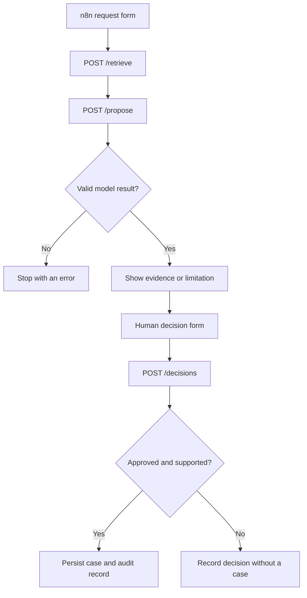

# Architecture

The system has two services: n8n handles the forms and workflow, and a Python API handles retrieval, model calls and case storage. SQLite holds the state between requests. The API uses the Python standard library; n8n is pinned to version 2.38.6 in Docker Compose.

## Request flow



The human review form appears for both supported and insufficient results. The API enforces the action rules independently of the form selection. Invalid output, expired proposals and changed source files stop processing before case creation.

## Retrieval and evidence selection

At startup, the API reads the Markdown policies and splits them at section headings. Each chunk includes its ID, title, section, version, review queue and source-file SHA-256 hash. The current corpus contains eight chunks across three documents.

BM25 ranks sections using the question text and returns up to four candidates. A stored retrieval snapshot preserves the exact context used for the next step. If there are no matches, the API skips the model call and returns insufficient evidence.

For matching candidates, the model receives the question and retrieved sections. Its response has three fields:

```json
{"status": "supported", "evidence_ids": ["AI-01"], "queue": "SecurityReview"}
```

A supported result must select one to three unique IDs from the retrieved context. Every selected section must have the same queue as the recommendation. An insufficient result must have an empty ID list and a null queue. Unknown fields, fabricated IDs and inconsistent queues fail validation.

The answer is assembled from the original excerpts. This preserves the wording and makes each recommendation easy to compare with its source. It also keeps the model response small. The tradeoff is a less conversational answer, and evidence relevance still depends on the model and reviewer.

## Approval and storage

The workflow passes a retrieval ID to `/propose`, then a proposal ID to `/decisions`. The API loads the corresponding records from SQLite instead of trusting replacement evidence or case details from the client.

At decision time, the API checks:

- The proposal exists and is less than one hour old.
- The cited files still match their recorded hashes.
- The proposal has not already been processed.
- The decision is Approve or Reject, with a reviewer name and reason.

Only an approved, supported proposal creates a case. Approval of an insufficient result closes the review without an action. A rejected proposal remains rejected if the request is repeated.

A SQLite transaction and a unique constraint on `proposal_id` prevent duplicate cases during repeated or concurrent approvals. This applies to retries of the same proposal; a separate new request can create another case.

Source hashes use the raw file bytes at both ingestion and approval. Text is normalized separately for parsing, so unchanged Windows CRLF files do not trigger a false policy-change error. Editing a policy after retrieval blocks the decision until the API reloads the documents and a new request is submitted.

## API

All endpoints except `/health` require the `X-Demo-Token` integration header.

| Endpoint | Purpose |
|---|---|
| `GET /health` | Service status, document chunk count and key-configuration status |
| `POST /retrieve` | Store a question and its retrieved evidence; return a retrieval ID |
| `POST /propose` | Select and validate evidence; return a stored proposal |
| `POST /decisions` | Record human approval or rejection and create an eligible case |
| `GET /cases` | List persisted cases |
| `GET /audit` | List recorded retrieval, proposal, decision and case events |

The OpenAI key stays in the API process environment. n8n uses a separate integration token. Requests and document text are treated as untrusted model context, and the model cannot select arbitrary tools or endpoints.

## Design choices

**n8n forms:** Request intake, the review pause and the final result are visible in one workflow without a separate frontend.

**BM25:** The small corpus contains specific policy terms and section identifiers. Lexical search keeps retrieval simple to inspect. A larger corpus would need evaluation of synonym handling, hybrid retrieval and access filtering.

**SQLite:** Transactions and persistence are sufficient for this single-machine demonstration. The case-writing endpoint can later connect to an enterprise case system.

**Explicit approval:** Routing a question for review is useful without granting the underlying request. Case creation is a bounded action with a clear point for human judgment.

## Deployment limits

Docker Compose exposes both services on localhost. The API uses a development HTTP server, and provider calls require internet access. The model call has a 45-second timeout; provider failures stop the workflow without creating a case. Automatic retries are not implemented.

Reviewer identity is self-declared. There is no per-user RBAC or document ACL filtering. Audit records are persistent but mutable, and not every API error is recorded. Production deployment would require authenticated reviewer roles, protected audit storage, monitoring and a managed case-system integration.

## Validation

The [test record](../evidence/STATUS.md) separates application tests from live model results and n8n run screenshots. The checked-in JSON is the portable workflow definition. Verification of an export from the configured demonstration instance remains open.
