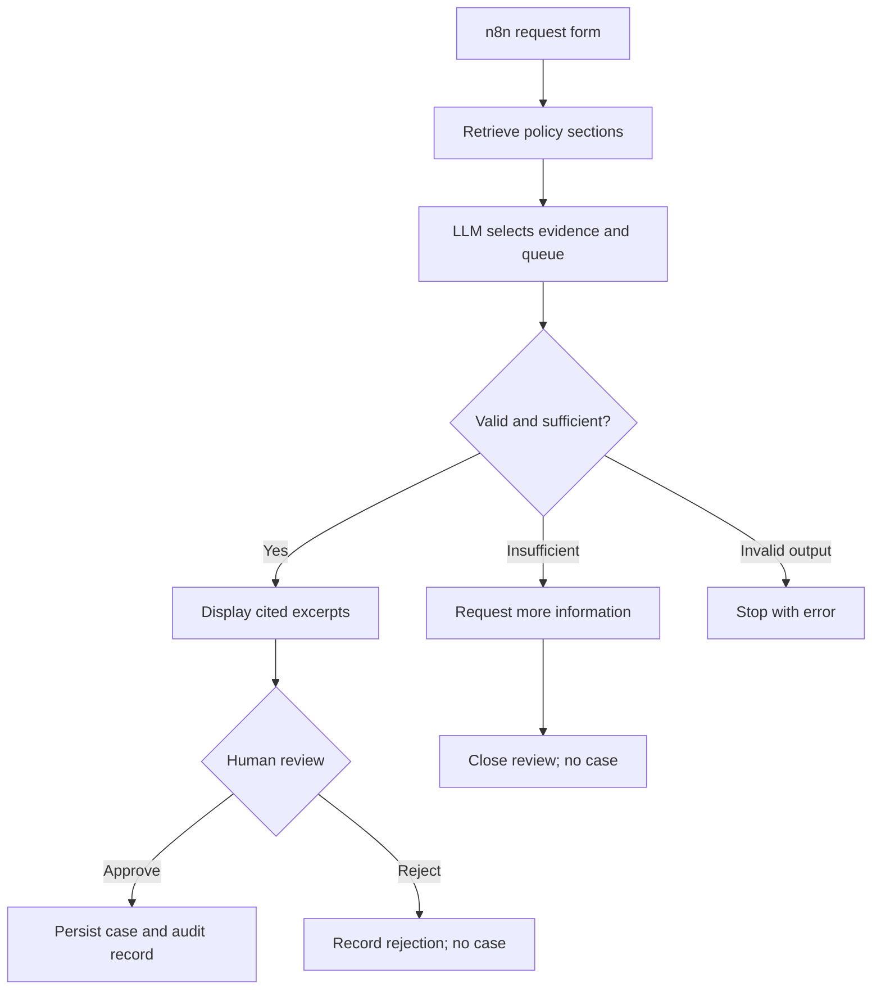

# Architecture and requirement mapping

This is an architecture diagram, not a screenshot of a live n8n run. The native workflow displays insufficient evidence in the review form too, but the server blocks case creation for that status regardless of the human selection.

## Assignment mapping

| Requirement | Implementation | Evidence to provide |
|---|---|---|
| Relevant customer and business problem | Fictional bank policy triage | Slides 1–2 and three synthetic policies |
| n8n, LangFlow or similar | n8n native forms and HTTP nodes | Exported workflow and full-canvas screenshot |
| LLM-powered decision | `/propose` invokes model for status, evidence IDs and queue | Live model node output |
| Mandatory RAG | Section chunking, BM25 top-4 retrieval, context passed to model | Retrieval output and cited review form |
| Grounded answers and citations | Exact excerpts rendered with section, title and version | Review screenshot and original policy |
| Insufficient-evidence handling | Fixed limitation message; no queue or case | Unsupported-question run |
| Human-in-the-loop | Native form pauses for explicit decision and reason | Waiting execution and review form |
| Real action | `/decisions` writes a SQLite case and audit records | Completion screen plus persisted case |
| Exported workflow | Imported/re-exported with n8n 2.38.6 | `workflows/cedarbridge-policy-agent.json` |
| Screenshots/video | Must capture actual final live workflow | Follow `START_HERE.md`, step 11 |
| Presentation up to 5 slides | Five-slide PPTX with notes | `presentation/Jeen-Policy-Agent.pptx` |

## Data and trust boundaries

The request and documents are untrusted model context. The integration token authenticates calls from n8n to the local API. The provider key stays in the Python process environment. The LLM returns no tool URL or executable code.

Retrieval snapshots are persisted on the server. The workflow sends only their IDs into the decision step, so it does not supply replacement evidence. Likewise, the action loads the server-stored proposal rather than accepting an arbitrary model-generated case body.

The model controls a bounded recommendation. It does not control the approval field. Human input determines approval or rejection, and the server independently enforces supported status, expiry, document-hash consistency and duplicate prevention. The case ID is returned from the database-backed action.

## Deliberate limitations

- The reviewer name is self-declared. No independent SSO, RBAC or separation of duties is enforced.
- The approval does not authorize an actual policy exception or vendor onboarding.
- Audit storage is persistent but not immutable, and API failures are not all audited.
- The Python HTTP server is intended for localhost demonstration, not public hosting.
- Documents are read at startup; restart after changes. There is no upload interface or live document sync.
- BM25 has limited synonym/paraphrase recall. Top-4 retrieval and human review may miss context on a larger corpus.
- Citation validation checks provenance and queue metadata, not semantic entailment.
- There is no vector database, Kubernetes, Terraform, enterprise connector, air-gap deployment or measured business ROI in this implementation.
- The LLM call has a 45-second timeout and no automatic retries. Errors stop before action. Production needs bounded retries and observable failure handling.

## Why this is a reasonable 4–5 hour proof of concept

The workflow demonstrates the required behaviors with three documents, one action type, one approval step, and two lightweight local services. It avoids a separate front-end application. n8n supplies the interaction and visible orchestration; the Python code holds the logic that should be testable outside the canvas.

The interface can later be swapped for an enterprise intake channel, and the SQLite case action for a real case-system connector. Those are extensions to discuss with the customer after validating the use case.
